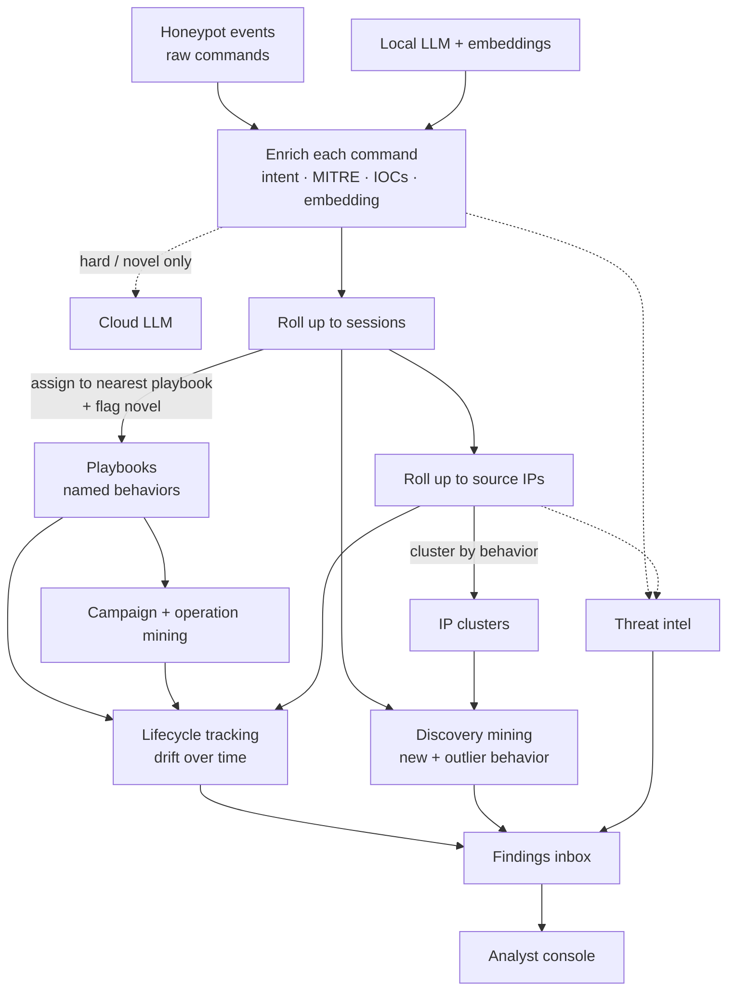

<p align="center">
  
</p>

<h1 align="center">DShield Prism</h1>

<p align="center"><em>Refract the noise. Resolve the behavior.</em></p>

<p align="center">
  <a href="LICENSE"></a>
  <a href="https://www.python.org/"></a>
  <a href="https://github.com/tonysperez/dshield_prism/actions/workflows/eval.yml"></a>
  <a href="https://github.com/tonysperez/dshield_prism/actions/workflows/ci.yml"></a>

</p>

<p align="center">
  <a href="docs/">Documentation</a> •
  <a href="console/">Investigation Console</a> •
  <a href="docs/roadmap.md">Roadmap</a>
</p>

---

Internet-facing honeypots are a firehose of mostly identical attacks. Buried in that deluge is the actually interetsing stuff - novel tactics, quietly drifting campaigns, a new cargo-cult IOC. Like many other datastreams, dashboards are a common method to try to make this immense amount of data somewhat digestable. But dashboards are only as useful as the data they're based on, and honeypot data is very raw; IPs commands, files, and timing. There's only so many ways you can vizualize this data, and honestly none of them are very useful.

What this raw data cannot show is exactly what I want to find; it can't what any of those attackers were actually *doing*, which ones were doing the same thing, which ones are doing something diffrent. Anything actually worth your time and attention stay buried under the roar of commodity internet scanning.

Prism is the enrichment and correlation layer that resolves behavior; it turns this flood of raw log events into a handful of named, tracked behaviors you can pivot on by *similarity* — not just by exact artifact — ground against threat intel, and watch change over time.

Built during my internship with the SANS Internet Storm Center to enable faster and more impactful analysis of the activity observed by my DShield sensor.

### Highlights

- **See behavior, not individual actions.** Every unique command, session, and source IP becomes a behavioral fingerprint with a semantic vector, intent, extracted IOCs, and MITRE TTP IDs.

- **Pivot on behavior, not just artifacts.** Most honeypot tooling (most log analysis tooling really) only pivots from one exact artifact to the same artifact — this IP, that exact command. Prism groups attacks by what they actually *do*, so you can ask the question that matters: "what else behaves like this?" — even when the IPs, files, and commands are all different.

- **Watch behavior change over time.** Recurring activity gets named as a playbook; coordinated multi-session activity gets grouped as a campaign — by shared behavior, by shared infrastructure, or (when those two overlap) as an Operation. All keep stable identities across re-analysis runs, so drift and emergence surface as findings in a curated inbox with a confirm/reject workflow that turns analyst decisions into a growing knowledge base.

- **Behaviors keep their identity over time.** Every recurring attack pattern gets a stable name that survives re-analysis, so when one drifts — a new command, a new target country, a sudden spike — that *change* surfaces as a finding instead of disappearing into the noise.

- **Private by default.** The AI analysis runs locally, on your own hardware — nothing about your honeypot traffic leaves the box unless you say so. Escalating a hard case to a frontier model is budget-constrained and opt-in. CTI feeds which require per-artifact queries are disabled by default. Sensor data is classified at ingest (a per-sensor configuration) and can be marked *confidential* so their data is never sent off-box at all, regaurdless of if cloud LLM and/or CTI queries are enabled.

- **Grounded in threat intel.** Artifacts (IP, URL, and file hash today; domain planned) are checked against freely available CTI feeds. A consensus engine collates verdicts and feeds them back into the pipeline: known-good scanners get quieted, commodity-malicious IPs get cheaper triage. Novelty is scored twice: against the sensor's own corpus *and* against an external reference corpus of documented adversary tradecraft (Atomic Red Team).

- **Hardened by real-world operation.** It has run continuously against a live sensor, and the safety rails earned their place: a daily cloud-spend cap, validation that catches the local AI inventing data that doesn't exist, and automatic cache refresh each stopped a real production failure — not a hypothetical one.

- **Measured and proven, not assumed.** Clustering quality is graded automatically against a hand-labeled answer key on every change. When my own measurements showed a central assumption was wrong, I rebuilt around the evidence. ([the gates, the numbers, the methodology](docs/evaluation.md))

## Live deployment

Prism has been running continuously against my home DShield sensor. Each analysis layer collapses a flood of raw activity into a handful of behaviors:

| Layer | Volume | Behaviors surfaced | Outliers |
|---|---:|---:|---:|
| Commands | ~3,000 distinct | 8 clusters | 39 |
| Sessions | 200,000 processed | 27 playbooks | 30 |
| Source IPs | 10,000 distinct | 171 clusters | 260 |

*Most of those 200,000 sessions are credential brute-force that never reach a shell. The ones that do dedup to ~3,000 distinct command forms, which in turn cluster into 8 behaviors. That reduction — a flood of raw activity down to a couple dozen named behaviors an analyst can actually reason about — is exactly the point of this pipeline.*

> **A few things running this in production taught me** ([more below](#lessons-learned)):
> - Built a per-day cloud LLM cost cap on day one. This saved me when a bug later
>   caused an endless query loop that would otherwise have burned my entire
>   Anthropic balance.
> - Small LLMs cheerfully invent MITRE TTP IDs that don't exist. Every
>   LLM-emitted TTP is schema-validated against the real ATT&CK corpus.
> - Shipped a finding kind that produced 2,000 findings on one corpus.
>   Retired it after one cycle. Not a bug, just a bad detection.

Caveat worth stating plainly: this is one home DShield sensor — a single vantage point and a single corpus. The pipeline is built to be sensor-agnostic, but I haven't yet validated it against a second deployment. So read the cluster and campaign counts as evidence the method works on real adversarial traffic, not as a claim about how it behaves at fleet scale.

## Pipeline



*Solid lines: the always-on local pipeline. Dashed lines: the opt-in cloud LLM and external threat-intel feeds.*

From a raw command line to a tracked behavior, in six steps:

1. **Enrich every command.** A honeypot records the raw text of everything an attacker types. Prism hands each *unique* command to a local LLM which explains what it does, the intent behind it, the MITRE ATT&CK techniques it maps to, and any IOCs it carries. This output is recorded, then converted it into an *embedding*: a numeric fingerprint where functionally similar commands land close together, even when the text is different. The few genuinely novel or low-confidence commands can (optional, opt-in) escalate to a frontier cloud model; everything else stays local, and identical commands are explained once and cached.

2. **Stack it up: command → session → IP.** The fingerprints of every command in one SSH login are pooled into a single fingerprint for the whole *session* — a compact summary of what that attacker actually did, while weighting rare or complex commands over boilerplate like `cd /tmp`. The same roll-up runs one level higher, giving each *source IP* a fingerprint of its overall behavior.

3. **Name the behavior.** Prism keeps a library of named attacker *playbooks* (e.g. *SSH Key Injection with chattr Locking*). Each new session is matched to its nearest playbook by fingerprint similarity; anything that matches nothing is flagged **novel**, and recurring novel behavior becomes a brand-new playbook the local LLM names itself. Those names are stable across re-runs, so a single behavior can be followed for weeks.

4. **Find the coordination.** With every IP labeled by the playbooks it runs, Prism mines for campaigns two independent ways — IPs running the same *combination* of playbooks, and IPs linked by shared *infrastructure* (a reused SSH key, a common payload URL). When both views land on the same group of IPs, that overlap is promoted to a high-confidence **Operation**.

5. **Ground it in the real world.** In parallel, the IOCs Prism extracted (IPs, URLs, file hashes) are checked against free threat-intel feeds, and a consensus engine reconciles sources that disagree. Crucially, it leans on *known-good* signals (like GreyNoise's researcher list) to quiet benign scanners, so the activity worth your attention stops drowning in noise.

6. **Surface what changed.** All of the above runs on a schedule, and two watchers turn it into the analyst's queue: one fires when a tracked behavior *drifts* (a playbook picks up a new command, a campaign adds IPs, a dormant actor returns), the other catches point-in-time surprises (a never-before-seen behavior, an IP whose intel verdict just flipped). Findings land in the inbox, where the analyst confirms or rejects each one — and every decision feeds back as fresh ground truth.

## Console

Eight pages, one analyst workflow: **Inbox · Graph · Browse · History · Hunts · Rules · Curation · Health**.

**Findings inbox.** Every drift, novel pattern, and coverage gap surfaces here. The facet rail narrows on score, age, IP-count band, intent, or intel verdict; status flows from new → ack → confirmed as the analyst works the queue.

<p align="center"></p>

**Investigation pivot.** Click any IOC and follow it through a graph of its behavioral neighborhood — linked IP clusters, session clusters, and constituent commands, with a side panel of overview details for whatever's selected. Right from that detail pane you can pick a peer for an **inline comparison** that shows what makes two clusters, playbooks, or campaigns separate: cosine similarity vs. the merge threshold, scalar-by-scalar deltas, and a plain-language explanation alongside the math.

<p align="center"></p>

**Report tool.** Gather every in-view artifact — IPs, commands, credentials, file hashes, MITRE chain, session sequences — into a copy-ready writeup, with IOCs defanged by default and a choice of plain / markdown / CSV / JSON output.

<p align="center"></p>

**Hunts.** Hypothesis-driven, YAML-defined session filters (AND-combined) that turn a hunch — "sessions that touched `/proc/cpuinfo` and were classified as non-recon intent" — into a repeatable, run-now finding stream. Ships with a preconfigured set. A parallel **Tradecraft Matches** view ranks sessions by how closely they mirror documented adversary tradecraft from the external reference corpus (Atomic Red Team).

<p align="center"></p>

## Why I built DShield Prism

My internship brief was simple: identify and analyze the attacks my DShield honeypot saw. I was not content with just any attack though, I wanted the *novel*, the *interesting*. Not the commodity internet scanning that dominates the logs.

Like most people, I started by ingesting the logs into Elastic and building dashboards. They work as a map: where attacks come from, the loudest and quietest attackers and commands, dropped files, user agents. But when I found something interesting, it was very time consuming to just put together that session and impossible to put together the complete picture. I had a command and the IP that ran it. I could pivot to every other IP that ran that exact command, and every other command that IP ran, but I was limited to pivoting by concrete, pre-existing artifacts. This means I could never pivot on behavior like 'What other IPs behave like this one?'.

Existing tooling either treats DShield logs as terminal output (parsers, dashboards) or analyzes individual artifacts (sandboxes). I didn't find a layer that does cross-session behavioral clustering on commodity honeypot input, so I built one: pipelines that turn raw events into meaningful behavioral signals, rather than another way to view them.

Prism is built to answer:
- Which commands are functionally similar to this one?
- What commands are typically run alongside this one, and what's the intent of the sequence?
- How does this IP behave, and what other IPs behave like it?
- What IPs don't behave like anything else in the corpus?
- Is this activity novel relative to my own corpus *and* relative to documented adversary tradecraft? Novelty is scored against both the sensor's own clusters and an external reference corpus (Atomic Red Team's per-MITRE-technique adversary emulation manifests); CTI feeds layer on top as a separate verdict signal.

## Status & roadmap

- [x] Cowrie ingestion + full enrichment pipeline
- [ ] Webhoneypot ingestion *(planned)*
- [ ] DShield firewall ingestion *(TBD, pending value decision)*

Everything else lives in [docs/roadmap.md](docs/roadmap.md).

## Install

```bash
sudo bash setup/2-setup.sh
```

Idempotent. Requires `.env` + `config/local.yaml` filled in, and a reachable LLM server. See [docs/operations.md](docs/operations.md) for setup details, configuration, and operational workflows.

## Run

```bash
sudo -u dshield_prism .venv/bin/python -m enrich.cli healthcheck
sudo -u dshield_prism .venv/bin/python -m enrich.cli enrich
```

The systemd timers (`dshield_prism-forward.timer` every 30 min;
`dshield_prism-backward.timer` every 6 h) handle steady-state. See
[docs/operations.md](docs/operations.md#systemd-cadence).

## Documentation

Start at [docs/](docs/) — the index routes you to the right doc.

| Doc | What's in it |
|---|---|
| [docs/architecture.md](docs/architecture.md) | How it works — the pipeline, the behavioral model, labeling, intel, findings |
| [docs/operations.md](docs/operations.md) | Install, configure, CLI, systemd cadence, backfill, troubleshooting |
| [docs/reference.md](docs/reference.md) | The contract — indices, ECS schemas, stable ids, tunables, intel internals |
| [docs/evaluation.md](docs/evaluation.md) | The eval set, the quality gates, and what the measurements found |
| [docs/decisions.md](docs/decisions.md) | Why it's built this way + the dead-ends that were measured and rejected |
| [docs/roadmap.md](docs/roadmap.md) | Open work |

## License

Licensed under [GPL-3.0](LICENSE).

## Lessons Learned

### Production Lessons
- I had unintentionally used an ES index which was owned and managed by Elastic Fleet. This was fine, until Fleet decided to wipe all the indices it controls. I now have the setup script manually create the index to ensure Fleet does not manage it and cannot wipe it.
- Originally, I had manually set LLM and embed config versioning. Like all manual things, this sounds fine until it hits ops and gets forgotten. Moved to a hash-based auto-invalidation system, so now I can't forget.
- Initially, every command's LLM enrichment was independent. This worked fine until my sensor started getting hammered with 1,000s of mostly identical commands, which started eating up all my local LLM cycles. I extended the command parsing system to run pre-enrichment, and skip local LLM enrichment for commands which are functionally identical to commands which have already been LLM enriched.
- My first version dropped any campaign artifact that appeared in >50% of sessions as 'too generic.' That killed real campaigns where everyone shared the same staging URL. Replaced with IDF weighting. Common artifacts still contribute, just less.
- I shipped a finding kind that produced 2,000 findings on one corpus and retired it after one cycle. There wasn't a bug in the code, the finding kind itself was just too noisy to be useful.

### Internet Observations
- Quite a significant piece of the general internet scanning is just a handful of the same copy/paste scripts.
- Cargo-cult code within scripts exists as a result of the above. This has funnily enough resulted in some pretty good IOCs, because literally nobody else will run a non-existent command except a script whose operator copy/pasted without bothering to understand it.

### AI in Production
- Validation, validation, validation. With a small 8B LLM model, I had to: give it heavy context + grounding; validate its output against my schema (it cheerfully made up MITRE TTP IDs); track output against a known baseline. Even when escalating the same query to a frontier model, I found this extra grounding and validation helped get its output just the way I wanted it.
- Cloud LLM costs can balloon, fast. I built cost-tracking and a per-day budget cap from day one — which saved me later when a bug caused an endless cloud-LLM query loop. Without the cap, that bug would have burned through my entire Anthropic balance in hours.

### Operational Lessons
- Dashboards seem a lot more useful than they are. I've found that they can make you feel like you have a handle on things, but don't survive 'What was this attacker actually doing?'. This project's goal is to close that gap.
- Known good is often more valuable than known bad. GreyNoise, while very limited on its free / Community plan, was one of the most important CTI feeds because they maintain a list of known researcher IPs, known as RIOT. This is an invaluable signal, since I found very quickly that I need to try as best I can to quiet the noise for the valuable activity to shine through.
- If you know behavior, you can keep up with rotating artifacts. One of my main drivers for this project was to be able to get a sense of how widely a particular attack is being used. Are we seeing one threat actor cycling through 100 IPs, or 100 threat actors each using 1 IP? If you can determine a threat actor's behavior, you can see through any particular attribute.