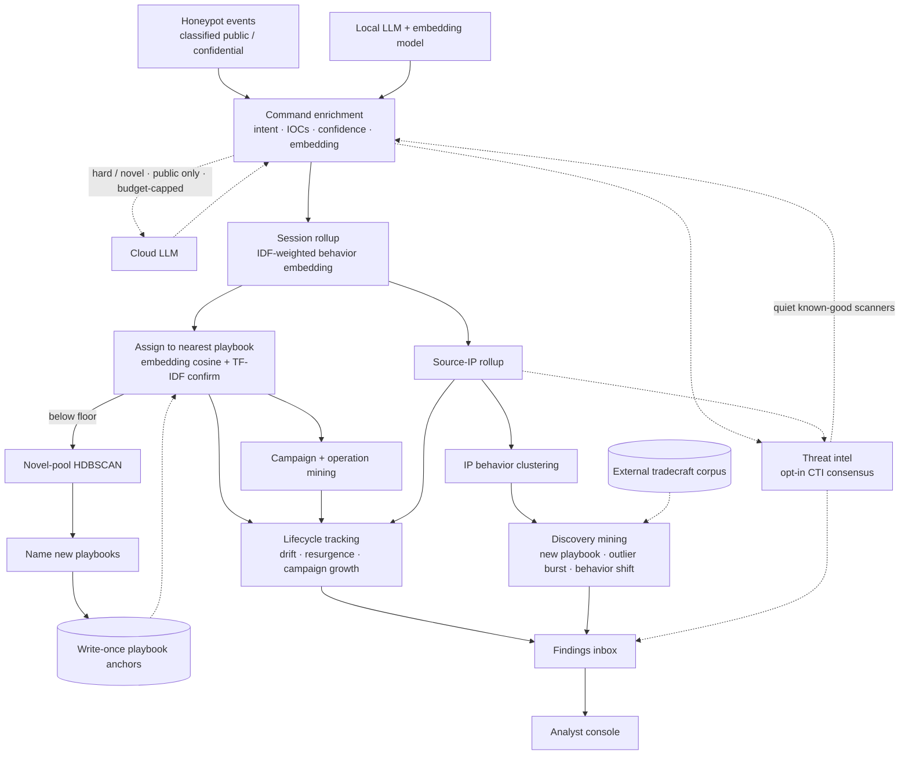

<p align="center">
  
</p>

<h1 align="center">DShield Prism</h1>

<p align="center"><em>Refract the noise. Resolve the behavior.</em></p>

<p align="center">
  <a href="LICENSE"></a>
  <a href="https://www.python.org/"></a>
  <a href="https://github.com/tonysperez/dshield_prism/actions/workflows/eval.yml"></a>
  <a href="https://github.com/tonysperez/dshield_prism/actions/workflows/ci.yml"></a>

</p>

<p align="center">
  <a href="docs/">Documentation</a> •
  <a href="console/">Investigation Console</a> •
  <a href="docs/roadmap.md">Roadmap</a>
</p>

---

Internet-facing honeypots observe a firehose of mostly identical attacks. Buried in that deluge is the stuff that is actually interesting: novel tactics, quiet drift on known campaigns, a new cargo-cult IOC. The usual answer is another dashboard, but charts over raw IPs, commands, files, and timing only get you so far.

Prism is an enrichment, correlation, and clustering pipeline that resolves honeypot activity into behavior: What is this attacker actually *doing*? What is the scope of the observed attack and infrastructure? Which attackers behave the same way? Which ones do not?

I built Prism during my internship with the SANS Internet Storm Center (ISC), where the work was often manual pivoting through DShield Cowrie and Webhoneypot logs. I wanted a tool that showed the attacker's behavior directly, so the analyst could spend time dissecting the attack rather than assembling it.

### Highlights

- **See behavior, not artifacts.** Commands, sessions, and source IPs become behavioral fingerprints. Prism matches new attacks against named behaviors, so you can ask "what else behaves like this?" even when individual IPs, commands, and payload URLs change.
- **Track behavior as it drifts.** Recurring command sequences become playbooks; coordinated IPs become campaigns; behavior and infrastructure overlap becomes a higher-confidence Operation. Stable identities make the change itself visible.
- **Weigh artifacts against CTI.** Extracted IPs, URLs, and files are checked against free threat-intel feeds, while known-good signals quiet benign scanners that would otherwise drown out useful activity.
- **Measured, not assumed.** Assignment, novelty, cluster purity, and label reliability are checked against a labeled eval set in CI. The headline case: I tested whether the session embedding separated behavior better than a plain TF-IDF baseline. It didn't — TF-IDF edged it on the controlled test. So I pulled the "semantics over text" claim, rebuilt session labeling as nearest-prototype assignment with a TF-IDF confirm, and recorded the standing consequence in [docs/decisions.md](docs/decisions.md) so it can't quietly come back. The rest lives in [docs/evaluation.md](docs/evaluation.md).
- **Private by default.** Local AI is the default. Cloud escalation and external CTI are opt-in, capped, and routed through a default-deny releasability check. See [Data governance & egress control](#data-governance--egress-control).

## Pipeline



*Solid lines: the always-on local pipeline. Dashed lines: opt-in or external paths — cloud LLM, CTI feeds, the external reference corpus, and intel feedback.*

From a raw command line to a tracked behavior, in six steps:

1. **Enrich every command.** Prism hands each *unique* command to a local LLM that explains what it does, its intent, and any IOCs it carries, then converts that into an *embedding* — a numeric fingerprint that places commands with similar behavior near one another. The few genuinely novel or low-confidence commands can optionally escalate to a frontier cloud model; everything else stays local, and identical commands are explained once and cached.

2. **Stack it up: command → session → IP.** The fingerprints of every command in one SSH login are pooled into a single fingerprint for the whole *session* — a compact summary of what that attacker actually did, weighting rare commands over boilerplate like `cd /tmp`. The same roll-up runs one level higher, giving each *source IP* a fingerprint of its overall behavior.

3. **Name the behavior.** Prism keeps a library of named attacker *playbooks*. Each new session is matched to its nearest playbook by fingerprint similarity — with a text-similarity check resolving borderline matches — and anything that matches nothing is flagged **novel**, with recurring novel behavior becoming a brand-new playbook. These names are stable across re-runs, so a single behavior can be followed over time.

4. **Find the coordination.** With every IP labeled by the playbooks it runs, Prism mines for campaigns two independent ways — IPs running the same *combination* of playbooks, and IPs linked by shared *infrastructure* (a reused SSH key, a common payload URL, etc). When both views land on the same group of IPs, that overlap is promoted to a high-confidence **Operation**.

5. **Ground it in the real world.** In parallel, the IOCs Prism extracted (IPs, URLs, file hashes) are checked against free threat-intel feeds, and a consensus engine reconciles sources that disagree. Crucially, it uses *known-good* signals (like GreyNoise's researcher list) to quiet benign scanners.

6. **Surface what changed.** All of the above runs on a schedule, and two watchers turn it into the analyst's queue: one fires when a tracked behavior *drifts* (a playbook picks up a new command, a campaign adds IPs, a dormant actor returns), the other catches point-in-time surprises (a never-before-seen behavior, an IP whose intel verdict just flipped). Findings land in the inbox, where the analyst confirms or rejects each one — and every decision feeds back as fresh ground truth.

## Console

The console turns the findings queue into an investigation. Every drift and
novelty lands in an **inbox**; from any card you pivot into a **graph** of the
behavior's neighborhood, **compare** it against a peer, pull the artifacts into a
**report**, watch the behavior **drift over time**, **ask** the corpus questions
in plain language, and **teach** it what you learn. Read-only against ES; the
Q&A runs on the same local model config as the pipeline, so nothing leaves the
box.

**Findings inbox.** Every drift, novel pattern, and coverage gap surfaces here. The facet rail narrows on score, age, IP-count band, intent, or intel verdict; status flows from new → ack → confirmed as the analyst works the queue.

<p align="center"></p>

**Investigation pivot.** Click any IOC and follow it through a graph of its behavioral neighborhood — linked IP clusters, session clusters, and constituent commands, with a side panel of overview details for whatever's selected. Right from that detail pane you can pick a peer for an **inline comparison** that shows what makes two clusters, playbooks, or campaigns separate: cosine similarity vs. the merge threshold, scalar-by-scalar deltas, and a plain-language explanation alongside the math.

<p align="center"></p>

**Report tool.** Gather every in-view artifact — IPs, commands, credentials, file hashes, session sequences — into a copy-ready writeup, with IOCs defanged by default and a choice of plain / markdown / CSV / JSON output. Generation runs against the local LLM; cloud escalation for write-ups is currently disabled — the console can't yet re-resolve a write-up's source documents server-side to prove they're explicit-public before that content would leave the box.

<p align="center"></p>

**Hunts.** Hypothesis-driven, YAML-defined session filters (AND-combined) that turn a hunch — "sessions that touched `/proc/cpuinfo` and were classified as non-recon intent" — into a repeatable, run-now finding stream. Ships with a preconfigured set. A parallel **Tradecraft Matches** view ranks sessions by how closely they mirror documented adversary tradecraft from the external reference corpus (Atomic Red Team).

<p align="center"></p>

Four more surfaces round out the workflow:

- **Track behavior over time.** A longitudinal view with one row per playbook, cluster, campaign, or operation — each with its own activity band on a shared timeline, a live-period strip, and an `interest` ranking — so a behavior going dormant and returning is something you *see*, not something you have to query for.
- **Ask in plain language.** A natural-language Q&A box answers questions over the enriched corpus using the local LLM — no query syntax, no data leaving the box.
- **Operational visibility.** A health page shows corpus stats, index freshness, recent run and ops telemetry, ES heap pressure, per-sensor breakdown, and command-grounding coverage — so you know the pipeline is actually keeping up.
- **Teach it.** Define what an unusual command does, pin a meaning to an attributed IOC (say, an RSA key), or leave a note on a specific attack. That knowledge folds straight back into clustering and labeling, so a correction made once sharpens every run that follows.

## Live deployment & quality

Prism runs continuously on one live DShield sensor and has ingested 10+ years of history from others: roughly 57 million raw events across 9.6 million sessions. Most of those sessions are credential brute-force that never reach a shell; the command-bearing subset is where Prism collapses raw activity into analyst-sized behavior sets.

| Layer | Volume | Behaviors surfaced | Outliers |
|---|---:|---:|---:|
| Commands | 336,723 distinct | 215 clusters | 1,284 (0.4%) |
| Sessions | 247,282 with commands | 150 playbooks | 253 (0.1%) |
| Source IPs | 82,271 command-bearing | 3,081 clusters | 4,770 (5.8%) |

Reduction only matters if the buckets are useful, so Prism keeps the measurements close to the code. Every number below names its geometry: *label-prototype* grades the algorithm, *real-anchor* grades the deployed system. They disagree, and the gap is the interesting part.

| Question | Current read | Caveat |
|---|---:|---|
| Can the method recover analyst behavior labels? | 0.8565 accuracy / 0.7898 macro-F1 | Label-prototype geometry — grades the algorithm. CI half-width ±0.1579, wide enough that most single-change claims are unprovable; per-label reads below n=5 are a fold artifact, not evidence. |
| Does the deployed anchor library assign correctly? | 0.6385 macro-F1 / 0.6702 band-disabled | Real-anchor geometry — grades the running system, ±0.080. The gap to the row above is anchor coverage, not matcher quality. |
| Do sessions get a playbook? | 99.8% corpus-wide | The committed 37-anchor public snapshot assigns 78.9%; the rest fall to the novel pool for minting. |
| Are assigned anchors clean? | 0.9282 purity / 0.8685 homogeneity | Measures what assigned against that snapshot, not novel-tail quality. |
| Does novelty work? | 0.8841 recall / 0.5865 precision | Whole-label holdout at the shipped τ, label-prototype. Re-measured real-anchor, novel precision drops to 0.21–0.30: the failure isn't missed discoveries but familiar-tail sessions landing in the novel pool. Noisiest surface in the system; fix is scoped in the roadmap. |
| Is the answer key reliable? | κ 0.8656 / PABAK 0.7875 | n=160 overlap; the second pass is an LLM annotator under the same rubric, not a second human. |

The eval set is intentionally modest: 271 annotated session blocks, 247 of them attributed to one of 10 behaviors, built to catch regressions on this project rather than serve as a public benchmark. Some behaviors are rare, confidence intervals are wide, and small metric moves can be real but unprovable at this scale. Those limits are documented rather than hidden.

The deeper methodology, baseline files, geometry distinction, and measured dead ends are in [docs/evaluation.md](docs/evaluation.md) and [docs/decisions.md](docs/decisions.md).

> **The 0.8% that had no name.** Of 8,536 command-bearing sessions observed over three months, 89% sorted into 25 named behaviors. The remaining 70 were flagged outright as outliers: 57 source IPs, 52 distinct command streams, every one maximally novel against the sensor's own history. Among them were sessions that wrote an ELF binary through ~2,000 consecutive `echo` statements of base64, droppers branching across seven architectures, and one session that remounted `/tmp` executable before doing anything else.

## Data governance & egress control

Honeypot capture can be sensitive: a single session can hold real credentials, a victim's data, or detail that identifies the sensor. So every record is classified per-sensor at ingest (`dshield.classification`: `public` | `confidential`), and every egress path — the intel queue, command escalation, finding narratives — routes through one centralized check, [`is_releasable` / `releasable_filter`](src/enrich/classification.py). That check is fail-safe: it matches *only* explicitly-`public` records, so both confidential and untagged data stay put. Mark a sensor confidential and nothing it sees leaves the box, regardless of what else is switched on.

Prism's own weak points are enumerated rather than buried — the console ships with **no authentication** (which is why its systemd unit binds loopback), secrets live in `.env`, and the ad-hoc analyst query path is deliberately *not* classification-gated. All three, with mitigations and the reasoning, are in [SECURITY.md](SECURITY.md#known-limitations--read-before-deploying).

## Install

One command. An interactive wizard writes your config (no manual file editing),
then installs the pipeline, systemd timers, and console:

```bash
sudo bash setup/setup.sh
```

Idempotent and re-runnable. Full step-by-step setup, configuration, and
operational workflows are in [docs/operations.md](docs/operations.md).

### Prereqs

Prism has three components — ElasticStack + Fleet, local AI hosting, and the Prism pipeline + console — which can run on the same box or separate hosts. You'll need:

- **ElasticStack + Fleet** — tested against SecurityOnion's managed ES (an easy way to get both). 16 GB RAM / 4 CPU.
- **Elastic Agent** on whatever device houses the DShield logs (could be the DShield sensor itself, or another device if the logs are being shipped off the sensor before ingestion).
- **Local AI hosting** for the Nomic embedding model + a small LLM — 8 GB VRAM (ideal) or 12 GB RAM hosts the default Qwen3:8B. Smaller models can be used, but keep in mind that smaller models will generally produce worse output.
- **A host for the Prism pipeline + console** — tested on Ubuntu 24.04 LTS; ~2 GB RAM / 2 CPU for a small deployment, up to ~8 GB / 4 CPU for larger ones with frequent backfilling.

## Status & roadmap

- [x] Cowrie ingestion + full enrichment pipeline
- [ ] Webhoneypot ingestion *(planned)*
- [ ] DShield firewall ingestion *(TBD, pending value decision)*

Everything else lives in [docs/roadmap.md](docs/roadmap.md).

## Documentation

Start at [docs/](docs/) — the index routes you to the right doc.

| Doc | What's in it |
|---|---|
| [docs/architecture.md](docs/architecture.md) | How it works — the pipeline, the behavioral model, labeling, intel, findings |
| [docs/operations.md](docs/operations.md) | Install, configure, CLI, systemd cadence, backfill, troubleshooting |
| [docs/reference.md](docs/reference.md) | The contract — indices, ECS schemas, stable ids, tunables, intel internals |
| [docs/evaluation.md](docs/evaluation.md) | The eval set, the quality gates, and what the measurements found |
| [docs/decisions.md](docs/decisions.md) | Why it's built this way + the dead-ends that were measured and rejected |
| [docs/roadmap.md](docs/roadmap.md) | Open work |

## Lessons Learned

### Production Lessons
- I had unintentionally used an ES-owned index which was managed by Elastic Fleet. This was fine, until Fleet wiped all the indices it controls. I now have the setup script manually create the indices to ensure Fleet does not manage them and cannot wipe them.
- Originally, I had manually set LLM and embed config versioning to ensure clustering is always apples-to-apples. Like all manual things, this sounds fine until it hits ops and gets forgotten. Moved to a hash-based auto-invalidation system, so now I can't forget.
- Initially, every command's LLM enrichment was independent. This worked fine until my sensor started getting hammered with tens of thousands of mostly but not quite identical commands, which started eating up all my local LLM cycles. I extended the command parsing system to run pre-enrichment, and skip local LLM enrichment for commands which are functionally identical to commands which have already been LLM enriched.
- My first version dropped any campaign artifact that appeared in >50% of sessions as 'too generic.' That killed real campaigns in small corpora. Replaced with IDF weighting. Common artifacts still contribute, just less.
- I shipped a finding kind that produced 2,000 findings on one corpus and retired it after one cycle. There wasn't a bug in the code, the finding kind itself was just too noisy to be useful.

### Internet Observations
- Quite a significant piece of the general internet scanning is just a handful of the same copy/paste scripts.
- Cargo-cult code within scripts exists as a result of the above. This has funnily enough resulted in some pretty good IOCs, because nobody else will run a non-existent command except a script whose operator copy/pasted without bothering to understand it.

### AI in Production
- Validation, validation, validation. To ensure valid output the best I can from both the small local model as well as the frontier model, I had to: give it heavy context + grounding; validate its output against my schema; track output against a known baseline. Some outputs resisted even that — the model invented MITRE TTP IDs faster than schema-validation could catch them, so I eventually pulled LLM-derived MITRE TTP IDs altogether rather than ship an unreliable signal.
- Cloud LLM costs can balloon, fast. I built cost-tracking and a per-day budget cap from day one — which saved me later when a bug caused an endless cloud-LLM query loop. Without the cap, that bug would have made quick work of my entire Anthropic balance.

### Operational Lessons
- Dashboards seem a lot more useful than they are. I've found that they can make you feel like you have a handle on things, but don't survive 'What was this attacker actually doing?'.
- Known good is often more valuable than known bad. GreyNoise, while very limited on its free / Community plan, was one of the most important CTI feeds because they maintain a list of known researcher IPs, their RIOT list. This is an invaluable signal since I found very quickly that I need to try as best I can to quiet the noise for the valuable activity to shine through.
- If you know behavior, you can keep up with rotating artifacts. One of my main drivers for this project was to be able to get a sense of how widely a particular attack is being used. Are we seeing one threat actor cycling through 100 IPs, or 100 threat actors each using 1 IP? If you can determine a threat actor's behavior, you can see through any particular attribute.

---

**How this was built.** DShield Prism was built with the assistance of generative AI — directed, reviewed, and validated by me, the same discipline Prism applies to its own models. The decisions, the measurements, the dead-ends above, and the calls on what *not* to ship are mine; the AI was a tool I held to the project's own bar for evidence and validation.

## Standing on the Shoulders of Giants

Prism is made possible by a lot of excellent open-source projects and free-tier services:

- **Honeypot & data** — [Cowrie](https://github.com/cowrie/cowrie) captures the raw attacker activity; [DShield](https://www.dshield.org/) is the sensor program and log source; the [Elastic Stack](https://www.elastic.co/elastic-stack) (with Fleet + Elastic Agent) stores and ships it — easiest to stand up via [Security Onion](https://securityonionsolutions.com/).
- **Local AI** — [Ollama](https://ollama.com/) hosts the models on-box: [Qwen3](https://huggingface.co/lmstudio-community/Qwen3-8B-GGUF) for generation and [Nomic Embed Text](https://huggingface.co/nomic-ai/nomic-embed-text-v1.5) for embeddings.
- **Threat intel** — verdicts draw on [AbuseIPDB](https://www.abuseipdb.com/), [abuse.ch](https://abuse.ch/) (Feodo Tracker, MalwareBazaar, ThreatFox, URLhaus), [FireHOL](https://iplists.firehol.org/), [GreyNoise](https://www.greynoise.io/), the [Tor Project](https://www.torproject.org/) exit list, and [VirusTotal](https://www.virustotal.com/).
- **Command Grounding** — [TLDR](https://github.com/tldr-pages/tldr) provides detailed descriptions for Linux, Cisco, and Windows commands.
- **Reference corpora** — external novelty and tradecraft matching lean on [Atomic Red Team](https://github.com/redcanaryco/atomic-red-team).

And of course, the Python ecosystem underneath it all — [scikit-learn](https://scikit-learn.org/) (HDBSCAN), [FastAPI](https://fastapi.tiangolo.com/), [Pydantic](https://docs.pydantic.dev/), and friends.

## About

Built by **Tony S. Perez**. Questions, feedback, or want to talk shop? Find me here:

<p align="center">

  <a href="https://github.com/tonysperez"></a>&nbsp;

  <a href="https://www.linkedin.com/in/tonysperez"></a>&nbsp;

  <a href="https://tonystech.net"></a>
</p>

## License
Licensed under [GPL-3.0](LICENSE).
