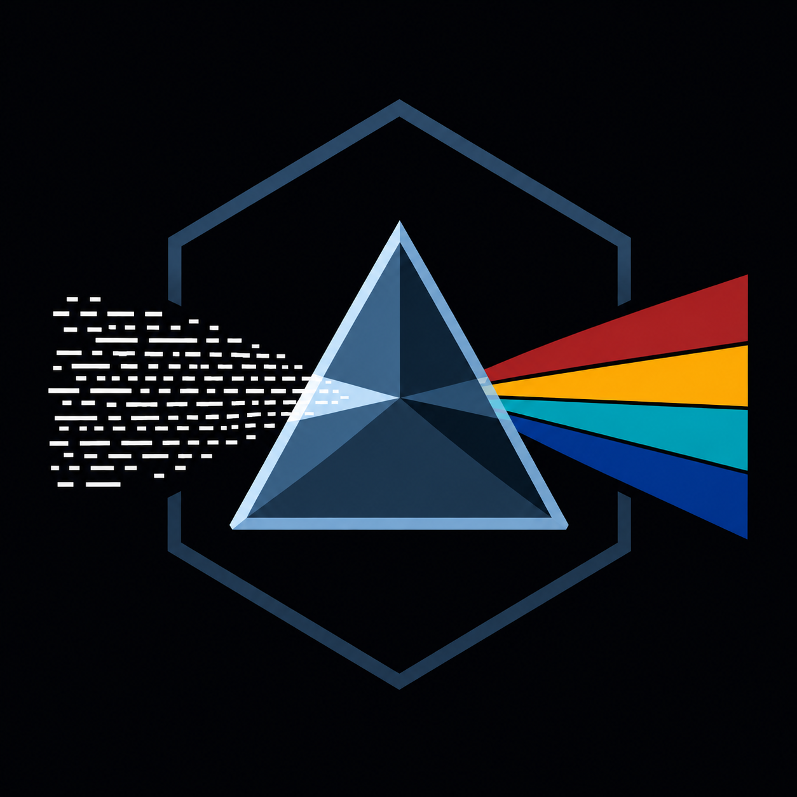
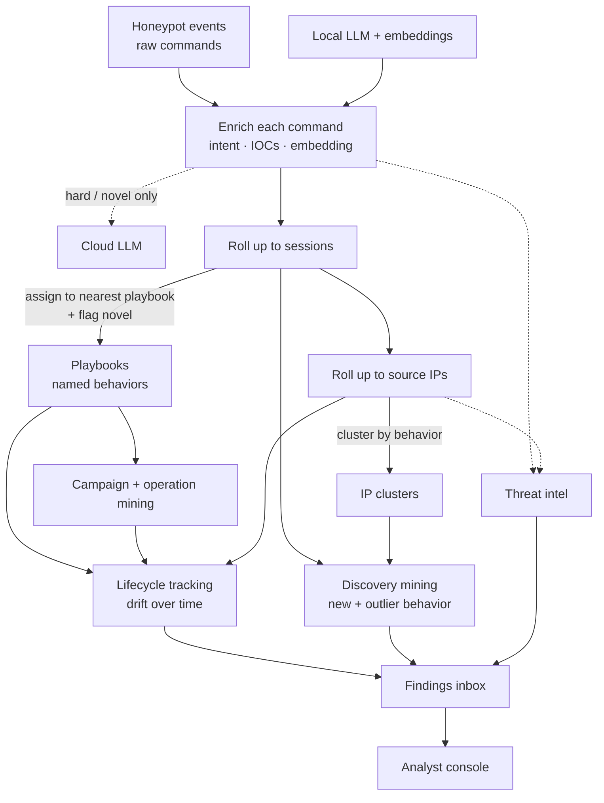
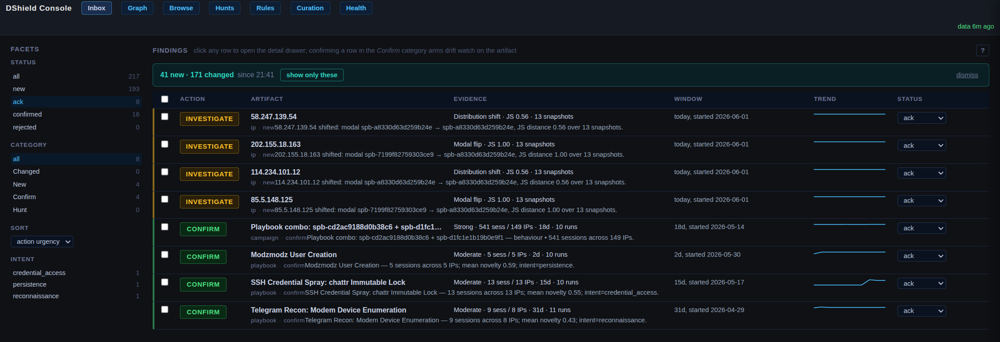
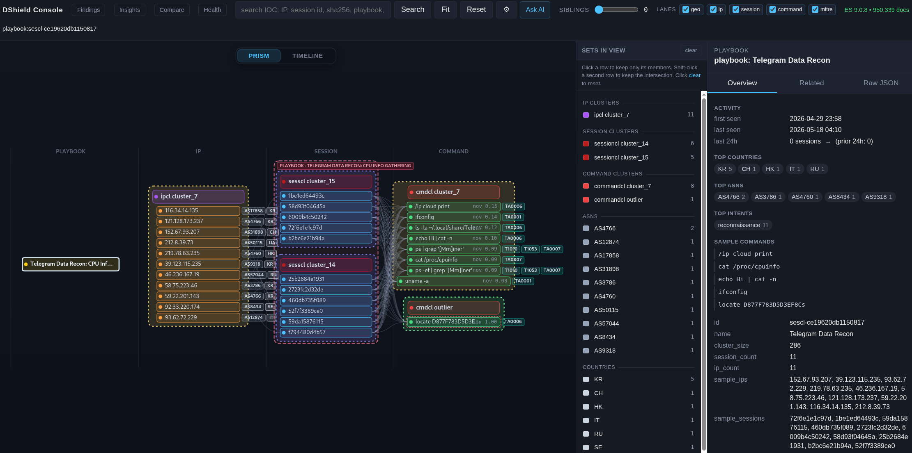
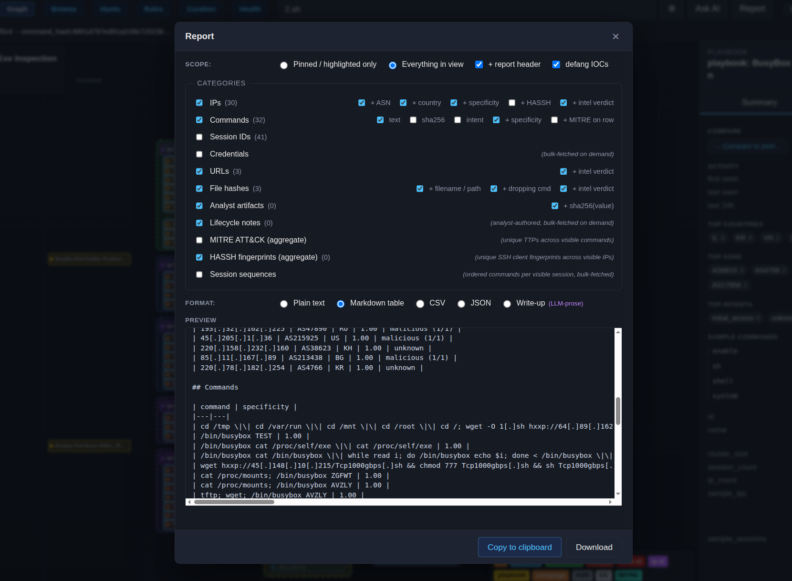
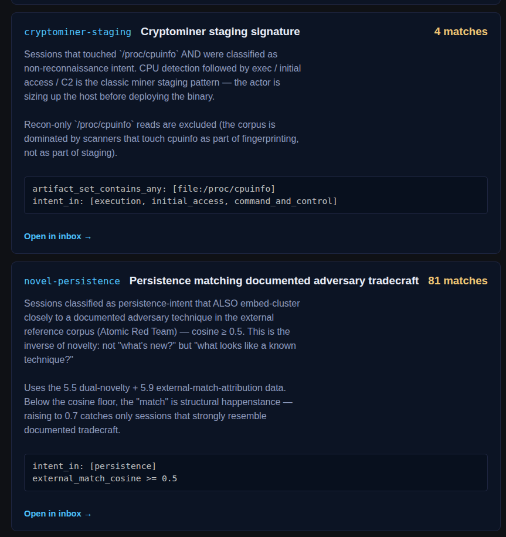

<p align="center">
  
</p>

<h1 align="center">DShield Prism</h1>

<p align="center"><em>Refract the noise. Resolve the behavior.</em></p>

<p align="center">
  <a href="LICENSE"></a>
  <a href="https://www.python.org/"></a>
  <a href="https://github.com/tonysperez/dshield_prism/actions/workflows/eval.yml"></a>
  <a href="https://github.com/tonysperez/dshield_prism/actions/workflows/ci.yml"></a>

</p>

<p align="center">
  <a href="docs/">Documentation</a> •
  <a href="console/">Investigation Console</a> •
  <a href="docs/roadmap.md">Roadmap</a>
</p>

---

Internet-facing honeypots observe a firehose of mostly identical attacks. Buried in that deluge is the stuff that is actually interesting; novel tactics, quiet drift on known campaigns, a new cargo-cult IOC. The usual answer to making this data digestible is a dashboard, but a dashboard is only as good as the data underneath it. Honeypot data is *accurate*, but raw: IPs, commands, files, timing. There are only so many ways to chart this raw data, and honestly, none of them are very useful.

Prism is an enrichment, correlation, and clustering pipeline which processes this blinding light, resolving behavior: What is this attacker actually *doing*? What is the full scope of their (observed) attack, of their infrastructure? Which other attackers are doing the same thing? Which attackers are not behaving like all the others?

I built Prism during my internship with the SANS Internet Storm Center (ISC). The brief was to look through DShield (Cowrie, Webhoneypot) logs to find and then analyze attacks. This is often done by hand, building lengthy commands to pull data as you pivot from artifact to artifact to artifact. Or sometimes by employing extra tooling to programmatically parse (not process) and visualize the logs.

I was not content with these modest abstractions though. I care about what the attacker is *doing*, not figuring out how to pull the data to assemble an inherently incomplete picture. I wanted a tool which would just show me what the attackers are doing so I can spend my time dissecting the attack rather than searching for it.

Here's the tool I built to achieve this.

### Highlights

- **See behavior, not artifacts.** Every command, session, and source IP becomes a behavioral fingerprint — what it actually *does*, its intent, and the IOCs it carries (includes both operator-defined IOCs and IOCs automatically extracted from commands). Most honeypot tooling only lets you pivot on concrete artifacts: this IP, that exact command. Prism matches each new attack against a library of named behaviors, so you can ask the question that matters — "what else behaves like this?" — even as the individual artifacts change.

- **Track behavior as it drifts.** A recurring command sequence becomes a named playbook; coordinated IPs become a campaign — and when behavior and infrastructure independently converge on the same group, a high-confidence Operation. Each keeps a stable identity across re-runs, so when one drifts — a new command, a new source country, a sudden spike — the *change* itself surfaces as a finding instead of vanishing into the noise.

- **Weigh artifacts against CTI.** Extracted artifacts (IP, URL, files) are checked against free CTI feeds, then a consensus engine reconciles them — known-good scanners get quieted so the activity worth your attention stops drowning in noise. Novelty is scored on two axes: against the sensor's own corpus (how similar is this to behavior already observed?) *and* against an external corpus of documented adversary tradecraft (Atomic Red Team).

- **Measured, not assumed.** Clustering quality is graded automatically against a hand-labeled answer key on every change. When my measurements showed my central assumption was wrong, I recentered on and rebuilt around the evidence. ([the gates, the numbers, the methodology](docs/evaluation.md))

- **Private by default — enforced, not promised.** The AI runs locally, on your own hardware; cloud escalation and external CTI lookups are off by default and hard-capped per day when enabled. The load-bearing part is *how* that holds: every path off the box routes through one fail-safe check, and only records explicitly classified `public` pass it. Untagged data is treated as confidential, so a missing tag can't leak. It's a default-deny boundary in code, not a rule the operator has to remember. ([the boundary](#data-governance--egress-control))

- **Hardened by real-world operation.** Prism has run continuously against live DShield sensors, and the safety rails earned their place: a daily cloud-spend cap, validation that catches the local model hallucinating data, and hash-based cache invalidation that can't be forgotten. Each one fixed a real production failure, not a hypothetical one.

## Live deployment

Prism runs continuously on one live DShield sensor and has ingested 4+ years of history from a second — roughly 57 million raw events across 9.6 million sessions. Each analysis layer collapses that flood into a handful of behaviors:

| Layer | Volume | Behaviors surfaced | Outliers |
|---|---:|---:|---:|
| Commands | 336,723 distinct | 215 clusters | 1,284 (0.4%) |
| Sessions | 247,282 with commands | 150 playbooks | 253 (0.1%) |
| Source IPs | 82,271 command-bearing | 3,081 clusters | 4,770 (5.8%) |

*Most of the ~9.6M sessions are credential brute-force that never reach a shell. The ~247K that do carry 336,723 distinct command forms between them — and those collapse to 215 command behaviors and 150 named session playbooks, plus 12 campaigns where infrastructure and behavior converge. (Source IPs cluster on a separate axis — 82K into ~3,000 behavioral groups.) That reduction — tens of millions of raw events down to a few hundred named behaviors an analyst can actually reason about — is exactly the point of this pipeline.*

**But are those groupings any good?** Reduction means nothing if the buckets are wrong. Quality is graded against 156 hand-labeled sessions across 10 behaviors — spread across attack types, not just easy commodity traffic — and re-checked in CI on every change so quality does not regress. Every figure below is the committed baseline in [`eval/`](eval/), not a best run:

- **It agrees with the analyst just under four times in five.** On sessions held out from its reference set, nearest-prototype assignment picks the analyst's playbook at **0.79 accuracy / 0.75 macro-F1** (`eval/baseline-assignment.json`). Macro-F1 trails accuracy because the rare behaviors are genuinely harder, so the gate floors every label *individually* — a collapse on a rare behavior can't hide behind the common ones.
- **It catches behavior it has never seen — and over-calls it.** Hold out a whole behavior and it reads as novel at **0.89 recall**, ranking unseen above known at **0.73 AUC**. But novel **precision is 0.58** (`eval/baseline-operational.json`): roughly two in five novelty flags are false alarms. That is the weakest number in the system and the one an analyst feels first.
- **Purity depends on which layer you ask about — so here are all of them.** Command clusters are **0.97** intent-pure (against the *model's own* intent label, so read it as self-consistency, not ground truth) and the 15 committed production anchors are **0.99** label-pure. Those are the easy layers. Unsupervised session clustering at full production scale scores **0.51 homogeneity / 0.088 ARI** against the analyst partition (`eval/baseline-prod-scale.json`) — which is exactly why Prism ships *assignment* rather than that clustering. At production anchors only **51% of sessions clear τ** and land on a playbook (`eval/baseline-assignment-prod.json`); the rest fall to the novel pool.

The gates print current-vs-baseline deltas on every run and fail the build on regression, so these numbers are checkable rather than asserted. [Full methodology, the weak spots, and the measured dead-ends](docs/evaluation.md).

**Scope, stated plainly.** This is one operator's tool, validated on a single live sensor plus a 4-year backfill from a second, not a fleet. The quality gates run against 156 hand-labeled sessions from a single annotator: enough to catch regressions on every change, not a published benchmark — and wide enough confidence intervals that the gate tolerances are correspondingly loose. Ingestion is Cowrie (SSH/Telnet) today; webhoneypot and firewall sources are on the roadmap. Read the cluster and campaign counts as evidence the method works on real adversarial traffic — not as a claim about how it behaves at fleet scale.

> **The 0.8% that had no name.** Of 8,536 command-bearing sessions observed over three months, 89%
> sorted into 25 named behaviors. The remaining 70 did not just fail to match — they were flagged
> outright as outliers: 57 source IPs, 52 distinct command streams, every one scored
> maximally novel against the sensor's own history. Among them: four sessions
> that wrote an ELF binary to disk through ~2,000 consecutive `echo` statements of base64,
> with no download URL and no file hash to pivot on; droppers that branch on `uname -m`
> across seven architectures; and one that remounts `/tmp` executable before doing anything
> else. No signature would have caught these, because no signature existed yet — they were
> ranked on being unlike the sensor's own history, not on matching a rule. Seventy sessions
> reach the inbox; the commodity remainder stays quiet.

> **A few things running this in production taught me** ([more below](#lessons-learned)):
> - A per-day cloud-LLM cost cap, built day one, later saved me when a bug caused an endless query loop.
> - Small LLMs invent MITRE TTP IDs that don't exist — schema-validation fixed this, but couldn't make the mapping trustworthy, so I pulled it.
> - A finding kind that produced 2,000 findings on one corpus, retired after one cycle. Not a bug, just a bad detection.

## Pipeline



*Solid lines: the always-on local pipeline. Dashed lines: the opt-in cloud LLM and external threat-intel feeds.*

From a raw command line to a tracked behavior, in six steps:

1. **Enrich every command.** Prism hands each *unique* command to a local LLM that explains what it does, its intent, and any IOCs it carries, then converts that into an *embedding* — a numeric fingerprint that places commands with similar behavior near one another. The few genuinely novel or low-confidence commands can optionally escalate to a frontier cloud model; everything else stays local, and identical commands are explained once and cached.

2. **Stack it up: command → session → IP.** The fingerprints of every command in one SSH login are pooled into a single fingerprint for the whole *session* — a compact summary of what that attacker actually did, weighting rare commands over boilerplate like `cd /tmp`. The same roll-up runs one level higher, giving each *source IP* a fingerprint of its overall behavior.

3. **Name the behavior.** Prism keeps a library of named attacker *playbooks*. Each new session is matched to its nearest playbook by fingerprint similarity — with a text-similarity check resolving borderline matches — and anything that matches nothing is flagged **novel**, with recurring novel behavior becoming a brand-new playbook. These names are stable across re-runs, so a single behavior can be followed over time.

4. **Find the coordination.** With every IP labeled by the playbooks it runs, Prism mines for campaigns two independent ways — IPs running the same *combination* of playbooks, and IPs linked by shared *infrastructure* (a reused SSH key, a common payload URL, etc). When both views land on the same group of IPs, that overlap is promoted to a high-confidence **Operation**.

5. **Ground it in the real world.** In parallel, the IOCs Prism extracted (IPs, URLs, file hashes) are checked against free threat-intel feeds, and a consensus engine reconciles sources that disagree. Crucially, it uses *known-good* signals (like GreyNoise's researcher list) to quiet benign scanners.

6. **Surface what changed.** All of the above runs on a schedule, and two watchers turn it into the analyst's queue: one fires when a tracked behavior *drifts* (a playbook picks up a new command, a campaign adds IPs, a dormant actor returns), the other catches point-in-time surprises (a never-before-seen behavior, an IP whose intel verdict just flipped). Findings land in the inbox, where the analyst confirms or rejects each one — and every decision feeds back as fresh ground truth.

## Console

The console turns the findings queue into an investigation. Every drift and
novelty lands in an **inbox**; from any card you pivot into a **graph** of the
behavior's neighborhood, **compare** it against a peer, pull the artifacts into a
**report**, watch the behavior **drift over time**, **ask** the corpus questions
in plain language, and **teach** it what you learn. Read-only against ES; the
Q&A runs on the same local model config as the pipeline, so nothing leaves the
box.

**Findings inbox.** Every drift, novel pattern, and coverage gap surfaces here. The facet rail narrows on score, age, IP-count band, intent, or intel verdict; status flows from new → ack → confirmed as the analyst works the queue.

<p align="center"></p>

**Investigation pivot.** Click any IOC and follow it through a graph of its behavioral neighborhood — linked IP clusters, session clusters, and constituent commands, with a side panel of overview details for whatever's selected. Right from that detail pane you can pick a peer for an **inline comparison** that shows what makes two clusters, playbooks, or campaigns separate: cosine similarity vs. the merge threshold, scalar-by-scalar deltas, and a plain-language explanation alongside the math.

<p align="center"></p>

**Report tool.** Gather every in-view artifact — IPs, commands, credentials, file hashes, session sequences — into a copy-ready writeup, with IOCs defanged by default and a choice of plain / markdown / CSV / JSON output.

<p align="center"></p>

**Hunts.** Hypothesis-driven, YAML-defined session filters (AND-combined) that turn a hunch — "sessions that touched `/proc/cpuinfo` and were classified as non-recon intent" — into a repeatable, run-now finding stream. Ships with a preconfigured set. A parallel **Tradecraft Matches** view ranks sessions by how closely they mirror documented adversary tradecraft from the external reference corpus (Atomic Red Team).

<p align="center"></p>

Four more surfaces round out the workflow:

- **Track behavior over time.** A longitudinal view with one row per playbook, cluster, campaign, or operation — each with its own activity band on a shared timeline, a live-period strip, and an `interest` ranking — so a behavior going dormant and returning is something you *see*, not something you have to query for.
- **Ask in plain language.** A natural-language Q&A box answers questions over the enriched corpus using the local LLM — no query syntax, no data leaving the box.
- **Operational visibility.** A health page shows corpus stats, index freshness, recent run and ops telemetry, ES heap pressure, per-sensor breakdown, and command-grounding coverage — so you know the pipeline is actually keeping up.
- **Teach it.** Define what an unusual command does, pin a meaning to an attributed IOC (say, an RSA key), or leave a note on a specific attack. That knowledge folds straight back into clustering and labeling, so a correction made once sharpens every run that follows.

## Data governance & egress control

Honeypot capture can be sensitive: a single session can hold real credentials, a victim's data, or detail that identifies the sensor. So every record is classified per-sensor at ingest (`dshield.classification`: `public` | `confidential`), and every egress path — the intel queue, command escalation, finding narratives — routes through one centralized check, [`is_releasable` / `releasable_filter`](src/enrich/classification.py). That check is fail-safe: it matches *only* explicitly-`public` records, so both confidential and untagged data stay put. Mark a sensor confidential and nothing it sees leaves the box, regardless of what else is switched on.

Prism's own weak points are enumerated rather than buried — the console ships with **no authentication** (which is why its systemd unit binds loopback), secrets live in `.env`, and the ad-hoc analyst query path is deliberately *not* classification-gated. All three, with mitigations and the reasoning, are in [SECURITY.md](SECURITY.md#known-limitations--read-before-deploying).

## Lessons Learned

### Production Lessons
- I had unintentionally used an ES-owned index which was managed by Elastic Fleet. This was fine, until Fleet wiped all the indices it controls. I now have the setup script manually create the indices to ensure Fleet does not manage them and cannot wipe them.
- Originally, I had manually set LLM and embed config versioning to ensure clustering is always apples-to-apples. Like all manual things, this sounds fine until it hits ops and gets forgotten. Moved to a hash-based auto-invalidation system, so now I can't forget.
- Initially, every command's LLM enrichment was independent. This worked fine until my sensor started getting hammered with tens of thousands of mostly but not quite identical commands, which started eating up all my local LLM cycles. I extended the command parsing system to run pre-enrichment, and skip local LLM enrichment for commands which are functionally identical to commands which have already been LLM enriched.
- My first version dropped any campaign artifact that appeared in >50% of sessions as 'too generic.' That killed real campaigns in small corpora. Replaced with IDF weighting. Common artifacts still contribute, just less.
- I shipped a finding kind that produced 2,000 findings on one corpus and retired it after one cycle. There wasn't a bug in the code, the finding kind itself was just too noisy to be useful.

### Internet Observations
- Quite a significant piece of the general internet scanning is just a handful of the same copy/paste scripts.
- Cargo-cult code within scripts exists as a result of the above. This has funnily enough resulted in some pretty good IOCs, because nobody else will run a non-existent command except a script whose operator copy/pasted without bothering to understand it.

### AI in Production
- Validation, validation, validation. To ensure valid output the best I can from both the small local model as well as the frontier model, I had to: give it heavy context + grounding; validate its output against my schema; track output against a known baseline. Some outputs resisted even that — the model invented MITRE TTP IDs faster than schema-validation could catch them, so I eventually pulled LLM-derived MITRE TTP IDs altogether rather than ship an unreliable signal.
- Cloud LLM costs can balloon, fast. I built cost-tracking and a per-day budget cap from day one — which saved me later when a bug caused an endless cloud-LLM query loop. Without the cap, that bug would have made quick work of my entire Anthropic balance.

### Operational Lessons
- Dashboards seem a lot more useful than they are. I've found that they can make you feel like you have a handle on things, but don't survive 'What was this attacker actually doing?'.
- Known good is often more valuable than known bad. GreyNoise, while very limited on its free / Community plan, was one of the most important CTI feeds because they maintain a list of known researcher IPs, their RIOT list. This is an invaluable signal since I found very quickly that I need to try as best I can to quiet the noise for the valuable activity to shine through.
- If you know behavior, you can keep up with rotating artifacts. One of my main drivers for this project was to be able to get a sense of how widely a particular attack is being used. Are we seeing one threat actor cycling through 100 IPs, or 100 threat actors each using 1 IP? If you can determine a threat actor's behavior, you can see through any particular attribute.

---

**How this was built.** DShield Prism was built with the assistance of generative AI — directed, reviewed, and validated by me, the same discipline Prism applies to its own models. The decisions, the measurements, the dead-ends above, and the calls on what *not* to ship are mine; the AI was a tool I held to the project's own bar for evidence and validation.

## Status & roadmap

- [x] Cowrie ingestion + full enrichment pipeline
- [ ] Webhoneypot ingestion *(planned)*
- [ ] DShield firewall ingestion *(TBD, pending value decision)*

Everything else lives in [docs/roadmap.md](docs/roadmap.md).

## Install

One command. An interactive wizard writes your config (no manual file editing),
then installs the pipeline, systemd timers, and console:

```bash
sudo bash setup/setup.sh
```

Idempotent and re-runnable. Full step-by-step setup, configuration, and
operational workflows are in [docs/operations.md](docs/operations.md).

### Prereqs

Prism has three components — ElasticStack + Fleet, local AI hosting, and the Prism pipeline + console — which can run on the same box or separate hosts. You'll need:

- **ElasticStack + Fleet** — tested against SecurityOnion's managed ES (an easy way to get both). 16 GB RAM / 4 CPU.
- **Elastic Agent** on whatever device houses the DShield logs (could be the DShield sensor itself, or another device if the logs are being shipped off the sensor before ingestion).
- **Local AI hosting** for the Nomic embedding model + a small LLM — 8 GB VRAM (ideal) or 12 GB RAM hosts the default Qwen3:8B. Smaller models can be used, but keep in mind that smaller models will generally produce worse output.
- **A host for the Prism pipeline + console** — tested on Ubuntu 24.04 LTS; ~2 GB RAM / 2 CPU for a small deployment, up to ~8 GB / 4 CPU for larger ones with frequent backfilling.

## Documentation

Start at [docs/](docs/) — the index routes you to the right doc.

| Doc | What's in it |
|---|---|
| [docs/architecture.md](docs/architecture.md) | How it works — the pipeline, the behavioral model, labeling, intel, findings |
| [docs/operations.md](docs/operations.md) | Install, configure, CLI, systemd cadence, backfill, troubleshooting |
| [docs/reference.md](docs/reference.md) | The contract — indices, ECS schemas, stable ids, tunables, intel internals |
| [docs/evaluation.md](docs/evaluation.md) | The eval set, the quality gates, and what the measurements found |
| [docs/decisions.md](docs/decisions.md) | Why it's built this way + the dead-ends that were measured and rejected |
| [docs/roadmap.md](docs/roadmap.md) | Open work |

## Standing on the Shoulders of Giants

Prism is made possible by a lot of excellent open-source projects and free-tier services:

- **Honeypot & data** — [Cowrie](https://github.com/cowrie/cowrie) captures the raw attacker activity; [DShield](https://www.dshield.org/) is the sensor program and log source; the [Elastic Stack](https://www.elastic.co/elastic-stack) (with Fleet + Elastic Agent) stores and ships it — easiest to stand up via [Security Onion](https://securityonionsolutions.com/).
- **Local AI** — [Ollama](https://ollama.com/) hosts the models on-box: [Qwen3](https://huggingface.co/lmstudio-community/Qwen3-8B-GGUF) for generation and [Nomic Embed Text](https://huggingface.co/nomic-ai/nomic-embed-text-v1.5) for embeddings.
- **Threat intel** — verdicts draw on [AbuseIPDB](https://www.abuseipdb.com/), [abuse.ch](https://abuse.ch/) (Feodo Tracker, MalwareBazaar, ThreatFox, URLhaus), [FireHOL](https://iplists.firehol.org/), [GreyNoise](https://www.greynoise.io/), the [Tor Project](https://www.torproject.org/) exit list, and [VirusTotal](https://www.virustotal.com/).
- **Command Grounding** — [TLDR](https://github.com/tldr-pages/tldr) provides detailed descriptions for Linux, Cisco, and Windows commands.
- **Reference corpora** — external novelty and tradecraft matching lean on [Atomic Red Team](https://github.com/redcanaryco/atomic-red-team).

And of course, the Python ecosystem underneath it all — [scikit-learn](https://scikit-learn.org/) (HDBSCAN), [FastAPI](https://fastapi.tiangolo.com/), [Pydantic](https://docs.pydantic.dev/), and friends.

## About

Built by **Tony S. Perez**. Questions, feedback, or want to talk shop? Find me here:

<p align="center">

  <a href="https://github.com/tonysperez"></a>&nbsp;

  <a href="https://www.linkedin.com/in/tonysperez"></a>&nbsp;

  <a href="https://tonystech.net"></a>
</p>

## License
Licensed under [GPL-3.0](LICENSE).