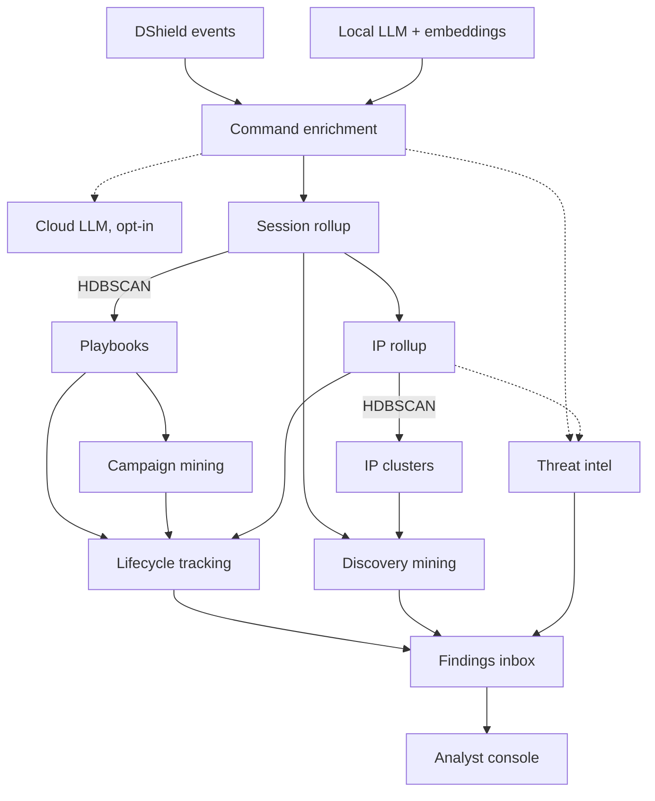
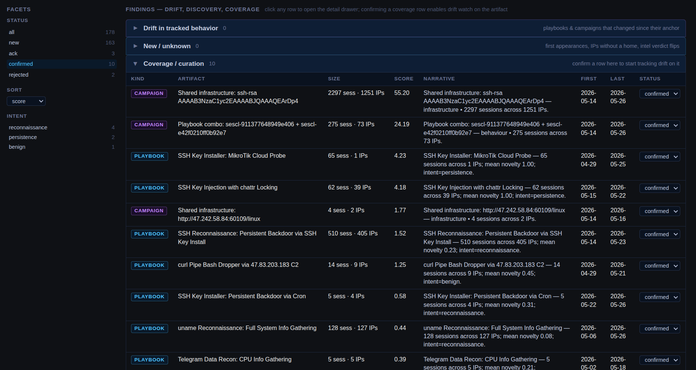
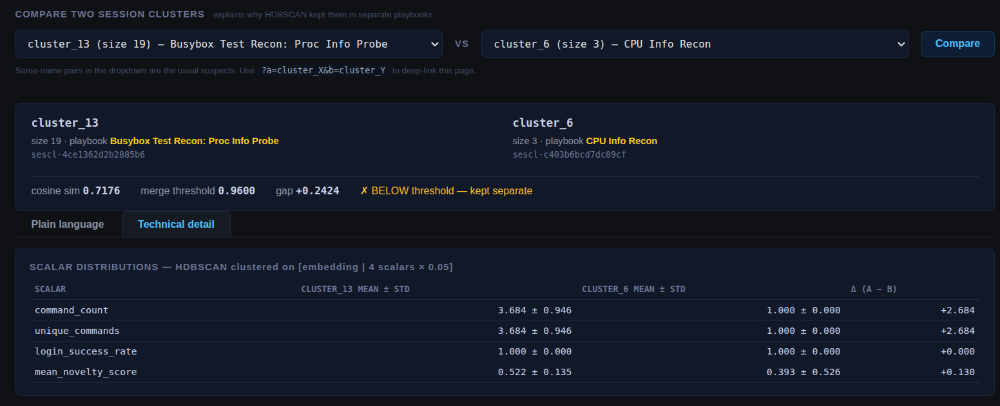

<p align="center">
  
</p>

<h1 align="center">DShield Prism</h1>

<p align="center"><em>Refract the noise. Resolve the behavior.</em></p>

<p align="center">
  <a href="LICENSE"></a>
  <a href="https://www.python.org/"></a>
  <a href="https://github.com/tonysperez/dshield_prism/commits/main"></a>
  <a href="https://github.com/tonysperez/dshield_prism/actions/workflows/ci.yml"></a>
</p>

<p align="center">
  <a href="docs/reference.md">Documentation</a> •
  <a href="console/">Investigation Console</a> •
  <a href="docs/ROADMAP.md">Roadmap</a>
</p>

---

A dashboard over honeypot logs tells you which IPs and commands are loudest, where they originate from, and the raw content of their actions. It can't tell you what an attacker is actually doing, or who else is doing the same thing: the new techniques, quiet drift, and emerging campaigns that matter stay buried under the noise of commodity internet scanning. Prism is the enrichment, correlation, and analysis layer that refracts that blinding light of logs into a rainbow of behavior.

Built during my internship with the SANS Internet Storm Center to enable faster and more impactful analysis of the activity my DShield sensor sees.

## A finding only behavioral analysis could surface

`cmp-beh-e6e6e5569e56d396` is a behavior campaign Prism mined from my live corpus: **73 source IPs across 35 countries and 57 ASNs**, all running the same combination of two playbooks over 275 sessions and 12 days:

- **SSH Key Injection with chattr Locking** (T1098.004, T1222.002) — installs an `authorized_keys` entry, then sets the immutable bit on `.ssh` so the key can't be removed without first unsetting it.
- **SSH Key Installer: Crontab list** (T1098.004, T1222.002, T1053.003) — installs the same `authorized_keys` entry, plus reconnaissance and `crontab -l` for cron-based re-installation.

Both playbooks install the *same* RSA public key (`SHA256:c2c1e9557c5abc30b71f1aae0b896e57ac16aba3add335ceebcc1701ae6cbb57`). The combination is defense-in-depth persistence: install the key, lock it with chattr, re-install via cron if it disappears.

No single command, IP, or artifact would have surfaced this. Prism caught it because frequent-itemset mining (FP-growth) over each IP's playbook set surfaced *"these 73 IPs run this exact combination"* — and the playbooks themselves only exist because session embeddings clustered into stable named behaviors.

The same RSA key shows up in `cmp-inf-cd57092a675b30ea`: a **1,251-IP infrastructure campaign** sharing the key across the broader corpus. The 73-IP behavior campaign is the subset that specifically uses chattr+cron. Two campaign axes (behavior and infrastructure) corroborate the same finding from different angles.

## Why that finding is trustworthy

The campaign above only means something if the clustering underneath it groups commands by *behavior*, not by text. `cluster_7` is the proof: **39 commands across 19 distinct leading binaries, near-zero textual overlap, all correctly grouped as one behavior** — host/environment fingerprinting.

```
w        uname -m      whoami      hostname      ifconfig      top
nproc || grep -c processor /proc/cpuinfo          lscpu | grep Model
free -m | grep Mem | awk '{print $2,$3,$4,$5,$6,$7}'
ls -la ~/.local/share/TelegramDesktop/tdata ...   /ip cloud print
```

Three properties hold at once, and only embedding-based clustering produces all three:

- **Maximal textual divergence** — members run from one character (`w`) to 90+; they share no common tokens.
- **Cross-dialect membership** — `/ip cloud print` is MikroTik RouterOS syntax, clustered alongside Linux coreutils. A string method has no basis to group these.
- **Total semantic coherence** — every member is host recon: CPU, memory, OS/arch, identity, network, competing miners (`ps | grep '[Mm]iner'`), and high-value loot (`ls … TelegramDesktop/tdata`).

A string-distance or command-prefix grouping would scatter these into ~19 buckets; the embedding placed them in one — because `w`, `uname -m`, and `/ip cloud print` do the same thing, they just don't look alike. The same invariance holds over shell-wrapping: `echo "…" | sh` and the bare command sequence cluster together because the embedding sees through the wrapper to the container-fingerprinting behavior underneath.

That's the project's core thesis — treat textually unrelated commands that do the same job (`wget` vs `curl`) as equivalent — holding under real adversarial input, and it's the foundation under everything above. Pull it out and the campaign collapses into noise.

## How it works

**See behavior, not individual actions.** Every unique command, session, and source IP becomes a behavioral fingerprint with a semantic vector, intent, extracted IOCs, and MITRE TTP IDs.

**Grounded in threat intel.** Artifacts (IP and URL today; hash and domain planned) are checked against freely available CTI feeds. A consensus engine collates verdicts and feeds them back into the pipeline: known-good scanners get quieted, commodity-malicious IPs get cheaper triage.

**Watch behavior change over time.** Recurring activity gets named as a playbook; coordinated multi-session activity gets grouped as a campaign. Both keep stable identities across re-analysis runs, so drift and emergence surface as findings in a curated inbox with a confirm/reject workflow that turns analyst decisions into a growing knowledge base.

**Private by default.** A local LLM does the cognitive work; cloud escalation is budget-capped and opt-in; CTI feeds are integrated but disabled by default. Nothing about your honeypot traffic leaves your environment unless you say so.

## Live deployment

Prism has been running continuously against my home DShield sensor. Each analysis layer collapses a flood of raw activity into a handful of behaviors:

| Layer | Volume | Behaviors surfaced | Outliers |
|---|---:|---:|---:|
| Commands | ~3,000 distinct | 8 clusters | 39 |
| Sessions | 200,000 processed | 27 playbooks | 30 |
| Source IPs | 10,000 distinct | 171 clusters | 260 |

*Most of those 200,000 sessions are credential brute-force that never reach a shell. The ones that do dedup to ~3,000 distinct command forms, which in turn cluster into 8 behaviors. That reduction — a flood of raw activity down to a couple dozen named behaviors an analyst can actually reason about — is the point.*

> **A few things running this in production taught me** ([more below](#lessons-learned)):
> - Built a per-day cloud LLM cost cap on day one. This saved me when a bug later
>   caused an endless query loop that would otherwise have burned my entire
>   Anthropic balance.
> - Small LLMs cheerfully invent MITRE TTP IDs that don't exist. Every
>   LLM-emitted TTP is schema-validated against the real ATT&CK corpus.
> - Shipped a finding kind that produced 2,000 findings on one corpus.
>   Retired it after one cycle. Not a bug, just a bad detection.

Caveat worth stating plainly: this is one home DShield sensor — a single vantage point and a single corpus. The pipeline is built to be sensor-agnostic, but I haven't yet validated it against a second deployment. So read the cluster and campaign counts as evidence the method works on real adversarial traffic, not as a claim about how it behaves at fleet scale.

## Pipeline



*Solid lines: always-on local pipeline. Dashed lines: opt-in cloud LLM and external CTI feeds.*

A local LLM + embedding model drives per-command enrichment, with optional escalation to a cloud LLM for the hardest cases. Session and IP rollups are HDBSCAN-clustered into named playbooks and IP clusters, then cross-IP campaign mining. Two streams reach the findings inbox: lifecycle tracking watches each playbook, campaign, and source IP over time so drift becomes a finding, while discovery mining surfaces outlier sessions and previously-unseen edges. A parallel intel pipeline grounds artifacts (URLs from commands, IPs from the rollup) against external feeds. The findings inbox is the analyst's curated triage queue, viewed through the console.

## Console

**Findings inbox.** Every drift, novel pattern, and coverage gap surfaces here. The facet rail narrows on score, age, IP-count band, intent, or intel verdict; status flows from new → ack → confirmed as the analyst works the queue.

<p align="center"></p>

**Investigation pivot.** Click any IOC and follow it through a graph of its behavioral neighborhood — linked IP clusters, session clusters, and constituent commands, with a side panel of overview details for whatever's selected.

<p align="center"></p>

**Cluster comparison.** Shows what makes two clusters separate, mathematically: cosine similarity vs. the merge threshold, scalar-by-scalar deltas, and a plain-language explanation generated alongside the technical detail.

<p align="center"></p>

## Why I built this

My internship brief was simple: identify and analyze the attacks my DShield honeypot saw. I was not content with just any attack though, I wanted the *novel*, the *interesting*. Not the commodity internet scanning that dominates the logs.

Like most people, I started by ingesting the logs into Elastic and building dashboards. They work as a map: where attacks come from, the loudest and quietest attackers and commands, dropped files, user agents. But the moment I found something interesting, building a complete picture fell apart. I had a command and the IP that ran it. I could pivot to every other IP that ran that exact command, and every other command that IP ran, but I was limited to pivoting by concrete, pre-existing artifacts. This means I could never pivot on behavior like 'What other IPs behave like this one?'. 

Existing tooling either treats DShield logs as terminal output (parsers, dashboards) or analyzes individual artifacts (sandboxes). I didn't find a layer that does cross-session behavioral clustering on commodity honeypot input, so I built one: pipelines that turn raw events into meaningful behavioral signals, rather than another way to view them.

Prism is built to answer:
- Which commands are functionally similar to this one?
- What commands are typically run alongside this one, and what's the intent of the sequence?
- How does this IP behave, and what other IPs behave like it?
- What IPs don't behave like anything else in the corpus?
- Is this activity known by the broader community, or is it novel?

## Status & roadmap

- [x] Cowrie ingestion + full enrichment pipeline
- [ ] Webhoneypot ingestion *(planned)*
- [ ] DShield firewall ingestion *(TBD, pending value decision)*

Everything else lives in [docs/ROADMAP.md](docs/ROADMAP.md).

## Install

```bash
sudo bash setup/setup.sh
```

Idempotent. Requires `.env` + `config/local.yaml` filled in, and a reachable LLM server. See [docs/reference.md](docs/reference.md) for setup details, configuration, and operational workflows.

## Run

```bash
sudo -u dshield_prism .venv/bin/python -m enrich.cli healthcheck
sudo -u dshield_prism .venv/bin/python -m enrich.cli enrich
```

The systemd timers (`dshield_prism-forward.timer` every 30 min;
`dshield_prism-backward.timer` every 6 h) handle steady-state. See
[docs/reference.md](docs/reference.md#systemd-cadence).

## Documentation

| Doc | What's in it |
|---|---|
| [docs/reference.md](docs/reference.md) | Operational notes, CLI, ECS schemas, tunables, intel subsystem, deploy recipes |
| [docs/ROADMAP.md](docs/ROADMAP.md) | Open work |
| [docs/history/](docs/history/) | Per-phase shipped behavior + design archive |

## License

Licensed under [GPL-3.0](LICENSE).

## Lessons Learned

### Production Lessons
- I had unintentionally used an ES index which was owned and managed by Elastic Fleet. This was fine, until Fleet decided to wipe all the indices it controls. I now have the setup script manually create the index to ensure Fleet does not manage it and cannot wipe it.
- Originally, I had manually set LLM and embed config versioning. Like all manual things, this sounds fine until it hits ops and gets forgotten. Moved to a hash-based auto-invalidation system, so now I can't forget.
- Initially, every command's LLM enrichment was independent. This worked fine until my sensor started getting hammered with 1,000s of mostly identical commands, which started eating up all my local LLM cycles. I extended the command parsing system to run pre-enrichment, and skip local LLM enrichment for commands which are functionally identical to commands which have already been LLM enriched.
- My first version dropped any campaign artifact that appeared in >50% of sessions as 'too generic.' That killed real campaigns where everyone shared the same staging URL. Replaced with IDF weighting. Common artifacts still contribute, just less.
- I shipped a finding kind that produced 2,000 findings on one corpus and retired it after one cycle. There wasn't a bug in the code, the finding kind itself was just too noisy to be useful.

### Internet Observations
- Quite a significant piece of the general internet scanning is just a handful of the same copy/paste scripts.
- Cargo-cult code within scripts exists as a result of the above. This has funnily enough resulted in some pretty good IOCs, because literally nobody else will run a non-existent command except a script whose operator copy/pasted without bothering to understand it.

### AI in Production
- Validation, validation, validation. With a small 8B model, I had to: give it heavy context + grounding; validate its output against my schema (it cheerfully made up MITRE TTP IDs); track output against a known baseline. Even when escalating the same query to a frontier model, I found this extra grounding and validation helped get its output just the way I wanted it.
- Cloud LLM costs can balloon, fast. I built cost-tracking and a per-day budget cap from day one — which saved me later when a bug caused an endless cloud-LLM query loop. Without the cap, that bug would have burned through my entire Anthropic balance in hours.

### Operational Lessons
- Dashboards seem a lot more useful than they are. I've found that they can make you feel like you have a handle on things, but don't survive 'What was this attacker actually doing?'. This project's goal is to close that gap.
- Known good is often more valuable than known bad. GreyNoise, while very limited on its free / Community plan, was one of the most important CTI feeds because they maintain a list of known researcher IPs, known as RIOT. This is an invaluable signal, since I found very quickly that I need to try as best I can to quiet the noise for the valuable activity to shine through.
- If you know behavior, you can keep up with rotating artifacts. One of my main drivers for this project was to be able to get a sense of how widely a particular attack is being used. Are we seeing one threat actor cycling through 100 IPs, or 100 threat actors each using 1 IP? If you can determine a threat actor's behavior, you can see through any particular attribute.