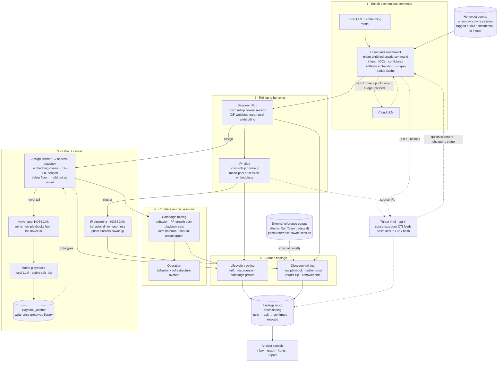

# Architecture

How Prism turns raw honeypot logs into behavior. This is the conceptual map;
for exact field names, indices, CLI verbs, and tunables see
[reference.md](reference.md), and for how it's installed and operated see
[operations.md](operations.md).

## Pipeline

*Numbered subgraphs are the pipeline stages. **Solid edges** are the always-on
local pipeline; **dashed edges** are opt-in or external — the cloud LLM, the CTI
feeds, the external reference corpus, and the intel feedback that quiets known
scanners. Cylinders are persisted ES indices.*

The pipeline runs as two systemd cadences — a fast **forward** pass over new
data and a slower **backward** pass that recomputes correlations. The stages:

1. **Command enrichment** — each unique command line gets one enrichment doc:
   LLM-generated description, intent, extracted IOCs, a confidence score, and a
   768-dim embedding. Hard/novel/low-confidence commands can escalate to a
   cloud LLM.
2. **Session rollup** — one doc per completed SSH session, aggregating its
   commands into a session embedding (IDF-weighted mean-pool) and behavioral
   stats.
3. **IP rollup** — one doc per source IP, aggregating its sessions.
4. **Labeling** — sessions are assigned to named **playbooks**; IP rollups are
   clustered; cross-IP **campaigns** are mined.
5. **Correlation over time** — lifecycle tracking watches each behavior so
   *drift* becomes a finding; discovery mining surfaces outliers and new edges.
6. **Grounding** — artifacts are checked against external threat-intel feeds.

All findings land in a curated **inbox**, viewed through the console.

## The three layers

Prism re-runs the same enrich → embed → cluster shape at three altitudes. Each
layer's centroids and per-doc novelty are persisted so identities stay stable
across runs.

| Layer | One doc per | What the embedding captures |
|---|---|---|
| **Command** | unique normalized command line | what a single command does |
| **Session** | completed SSH session | what an attacker did in one login |
| **IP** | source IP | how an IP behaves across all its sessions |

The session embedding is an **IDF-weighted mean-pool** of its command
embeddings: boilerplate (`cd /tmp`, `whoami`) gets near-zero weight, rare
commands dominate. The IP embedding is a mean-pool of its session embeddings.

Code: [`src/enrich/sources/cowrie/`](../src/enrich/sources/cowrie/) (`commands.py`,
`sessions.py`, `ips.py`).

## How sessions get labeled

Each session is **assigned to its nearest named playbook prototype** — a pinned
anchor library — by embedding cosine, with a TF-IDF secondary signal confirming
the ambiguous band and a floor below which a session is held out as **novel**.
HDBSCAN is retained only to *mint* fresh playbooks from that novel tail; it no
longer re-partitions the whole corpus every cycle.

This replaced full-corpus session clustering after measurement showed the
embedding earns no edge over a TF-IDF text baseline on this corpus — so labeling
moved from unsupervised clustering to nearest-prototype assignment, which is
cheaper, keeps stable playbook identities, and surfaces novelty directly. Prism
makes **no "semantics over text" claim**. The full negative result and the
assignment-quality numbers are in [evaluation.md](evaluation.md).

**Novelty is scored twice:** against the sensor's own corpus (a per-layer
reference-centroid set) *and* against an external reference corpus of documented
adversary tradecraft (see below). Code:
[`src/enrich/sources/cowrie/assignment.py`](../src/enrich/sources/cowrie/assignment.py).

## Behaviors: playbooks, campaigns, operations

- **Playbook** (`spb-<16hex>`) — an LLM-named recurring behavior. Its id is
  **cosine-anchored** to a write-once anchor index, so a playbook keeps its
  identity across re-analysis runs even as its membership changes. Naming uses
  the local LLM only and anchors on the commands/IOCs that most sessions share
  (session coverage), not on a handful of samples.
- **Campaign** — coordinated multi-session activity, mined two independent ways:
  - **behavior** (`cmp-bhv-…`) — frequent-itemset mining (FP-growth) over each
    IP's set of playbooks: "these IPs all run this exact combination."
  - **infrastructure** (`cmp-inf-…`) — connected components of a session graph
    linked by shared artifacts (URLs, SSH keys, file hashes).
- **Operation** (`cmp-ope-…`) — when a behavior campaign and an infrastructure
  campaign overlap, Prism promotes the intersection. Two axes corroborating the
  same finding: the infra axis names the shared-infrastructure pool, the
  behavior axis names the sub-population running the same tradecraft inside it.

Campaign and operation ids are content-addressed over their member sets, so they
inherit the playbooks' identity stability. Campaign names are programmatic (no
LLM). Code:
[`src/enrich/sources/cowrie/campaigns.py`](../src/enrich/sources/cowrie/campaigns.py).

## IP clustering — behavior-driven geometry

IP clusters group IPs by *what they do*, not *where they come from*. Country,
ASN, and SSH-client fingerprint (HASSH) are provenance/tool signals — directly
queryable after the fact — and pushing them into the clustering geometry
over-fragments the same behavior across hosting platforms and client tools. So
the IP geometry is built from behavioral signals (intent mix, playbook mix,
volume, an IP-as-bag-of-session-clusters block) plus credentials and intel.
Rationale and the measured win are in [decisions.md](decisions.md).

## Threat-intel grounding

Artifacts (IP, URL, file hash today; domain planned) are checked against freely
available CTI feeds. A **consensus engine** collates provider verdicts with a
two-tier precedence: direct-evidence malicious wins absolutely;
authoritative-clean (e.g. GreyNoise RIOT researcher IPs) overrides
aggregator-only malicious. Consensus requires agreement from *independent*
upstream feeds, so two wrappers of the same source don't count as corroboration.

Intel feeds back into the pipeline: known-good scanners get quieted, commodity-
malicious IPs get cheaper triage. The whole subsystem is opt-in
(`intel.enabled`, off by default). Code:
[`src/enrich/intel/`](../src/enrich/intel/).

### External reference corpus (novel-vs-the-world)

Beyond "novel vs my own corpus," Prism scores novelty against an external
baseline of documented adversary tradecraft. The first source is Red Canary's
**[Atomic Red Team](https://github.com/redcanaryco/atomic-red-team)** (MIT) — a
library of small adversary-emulation tests, one per MITRE technique. Each
eligible test becomes a synthetic reference session in
`prism.reference.cowrie.session`, embedded and clustered like live data, so
"novel vs the reference corpus" means "not a documented Atomic Red Team
technique." The design is source-agnostic (a `dshield.reference.source` tag, one
shared external centroid pool); MITRE CALDERA's stockpile is the obvious next
source. The console surfaces this as **Tradecraft Matches**. Import:
[`scripts/import_reference_corpus.py`](../scripts/import_reference_corpus.py).

## Findings: drift and discovery

Two streams reach the inbox, both via `mine findings`:

- **Lifecycle tracking** snapshots every playbook, campaign, and source IP each
  run, so change over time becomes a finding — command/sequence/artifact/geo/size
  **drift**, resurgence of a silent playbook, campaign growth.
- **Discovery mining** surfaces point-in-time signals — a new playbook, an
  intel-verdict flip, an IP whose behavior mix shifted, an outlier burst, two
  campaigns converging.

Each finding carries a status (`new → ack → confirmed`/`rejected`) that persists
across re-mines, turning analyst decisions into a growing knowledge base. Miners
have a per-run noise valve (a miner emitting more than a small fraction of its
source population is suppressed that run). Code:
[`src/enrich/findings/`](../src/enrich/findings/). The full finding-kind
vocabulary is in [reference.md](reference.md#findings) and the eval
[RUBRIC](../eval/RUBRIC.md).

## Privacy boundary

Per-sensor data is tagged `dshield.classification` (`public` | `confidential`)
at ingest. **Confidential data never reaches the cloud LLM or CTI feeds**, and
is propagated most-restrictive-wins through deduped commands, session rollups,
and IP rollups. The gate is fail-safe: untagged data is treated as confidential.
Central logic:
[`src/enrich/classification.py`](../src/enrich/classification.py). Every cloud-
or CTI-facing egress path gates on it — see [reference.md](reference.md#data-classification-privacy-gate).

## Console

A read-only, browser-based investigation console (FastAPI + vanilla JS +
Cytoscape). Eight pages around one analyst workflow:
**Inbox · Graph · Browse · History · Hunts · Rules · Curation · Health**. Search
any IOC and pivot through its behavioral neighborhood as a node-link graph;
compare two clusters/playbooks/campaigns inline; gather in-view artifacts into a
copy-ready report. History ranks every entity's whole activity arc
(playbooks, session/IP clusters, campaigns, operations) on a shared adaptive time
axis by a composite interest score (see [reference.md](reference.md#console)). It reads the enriched indices directly and never writes to
ES. See [`console/README.md`](../console/README.md).
